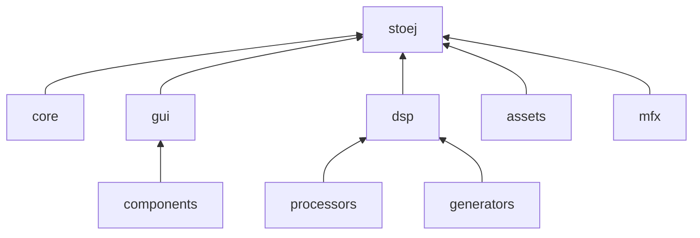
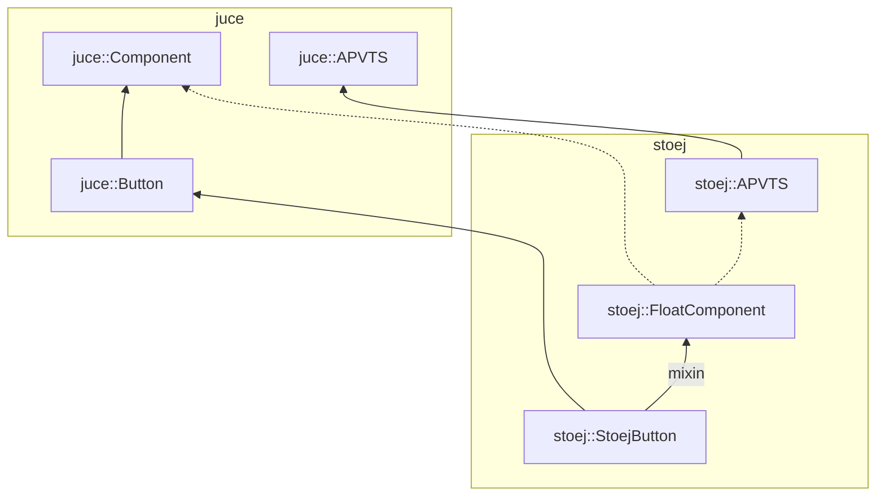

# Shared Code, Developer Guide

[TOC]

## Architecture

### Modules



### GUI Component Architecture



## Namespaces

The following namespaces are to be used:

### `stoej` namespace

All of the library stuff is in the `stoej` namespace. Since macros are unscoped in C++, they must always be prepended with `STOEJ_`, even if they are used internally.

### `stoej::strings` namespace

The JUCE library is a bit too [*stringly typed*](https://www.techopedia.com/definition/31876/stringly-typed), especially when dealing with parameters and properties on the APVTS. When using dictionary-like structures that use strings as keys, we are forced to use a lot of string literals. This is bad for maintainability, as we need to manually change all places where we use the literals in case we need to change the literals, we also lose a lot of static analysis like code completion. To gain back control and static analysis, we need to hide the string literals behind C++ symbols.

The `stoej::strings` namespace is where all these proxy symbols are defined. For example, let's say we have a parameter on the APVTs called `"filter_cutoff"`. We can hide it like so:

```c++
namespace stoej::strings {
    namespace parameters {
        inline const std::string filter_cutoff = "parameters::filter_cutoff";
    }
}
```

Then from this point onwards, whenever we need to use this string literal, we can write `stoej::strings::parameters::filter_cutoff` instead. In some cases we can even get away with having unique identifiers as strings, in which case the standard is to use [NanoID](https://www.npmjs.com/package/nanoid) strings.

### `stoej::binary_data` namespace

This namespace is used for auto-generated binary data embeddings, to keep them isolated from hand-written code.

## Interfacing with JUCE and the host

### Editor persistence with APVTS

TODO

### Stripping APVTS internals when saving state

TODO

## Design

### GUI component design

TODO: handshake, whatnot

### Template plugin structure

TODO

## Coding conventions

TODO

## DevOps

TODO